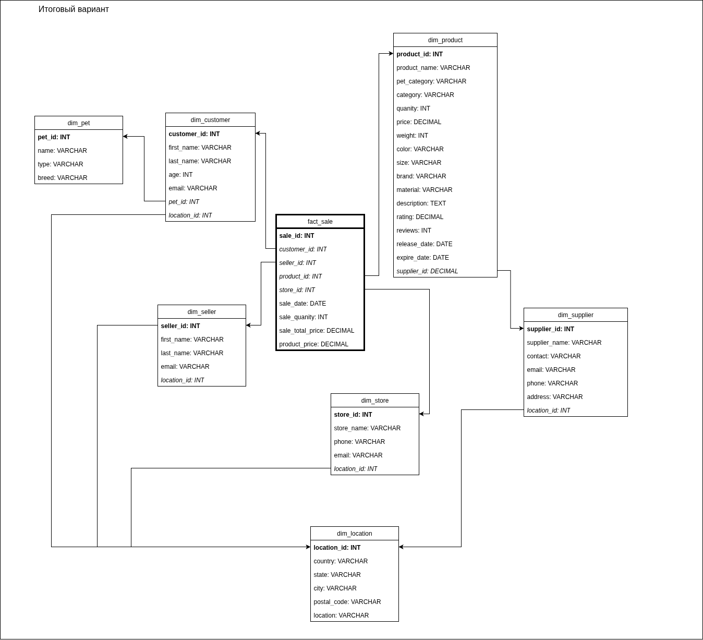

# Описание решения
Перед началом работы над лабораторной проанализируем исходные данные. Единая таблица CSV файла выглядит следущим образом:

Исходя из названий колонок, можно сразу заметить 6 выделяющихся таблиц измерений - `customer` `store` `seller` `product` `supplier` и таблицу фактов `sales`. Разделим данные по таблицам исходя из этой информации:

Далее можно представить несколько вариантов того как расположить таблицы в снежинку. Можно связать продавца с магазином и продукты с поставщиком, а в таблице покупателя отдельно выделить сущность питомца для нормализации данных.

Если отталкиваться от колонок с припиской `_id` в таблице фактов, то можно посчитать такую реализацию вполне допустимой. Одако также можно предположить, что на фактические продажи могут влиять все доступные в наших данных таблицы. Если это так, то добавим в таблицу продажи ключи по поставщикам и магазинам. Также нормализуем локации во всех таблицах, выделив их в отдельную сущность.

Смотря на оба полученных решения, я прихожу к следующим выводам:
1. В таблице фактов мы оставляем внешний ключ по id магазина, так как "условное" местоположение, акции, реклама конкретного магазина могут напрямую влиять на продажи;
2. Про поставщика я не могу также отзываться, поэтому убираем его, оставив внешний ключ по его id в таблице продукта;
3. Оставляем отдельные сущности "Локация" и "Питомец" для нормализации данных.

Итого получаем следующую схему:

После аналитической работы реализовываем функционал:
1. Инициализация сырых данных релизована в файле [init_mock_data.sql](/init/init_mock_data.sql);
2. Создание таблиц для снежинки - [DDL](/init/init_snowflake_tables.sql);
3. Вставка сырых данных в таблицы снежинки - [DML](/init/insert_snowflake_tables.sql).

# Запуск решения
Как и сказано в задании все реализовано и запускается в [docker-compose.yml](/docker-compose.yml). Для проверки необходимо только иметь установленный Docker.

В решении также предусмотрен [скрипт автоматизации](/run_solution.sh) для запуска контейнера, инициализации сырых данных, создания таблиц и их заполнения + проверка заполненности таблиц и вывод первых 10 строк таблицы фактов.
