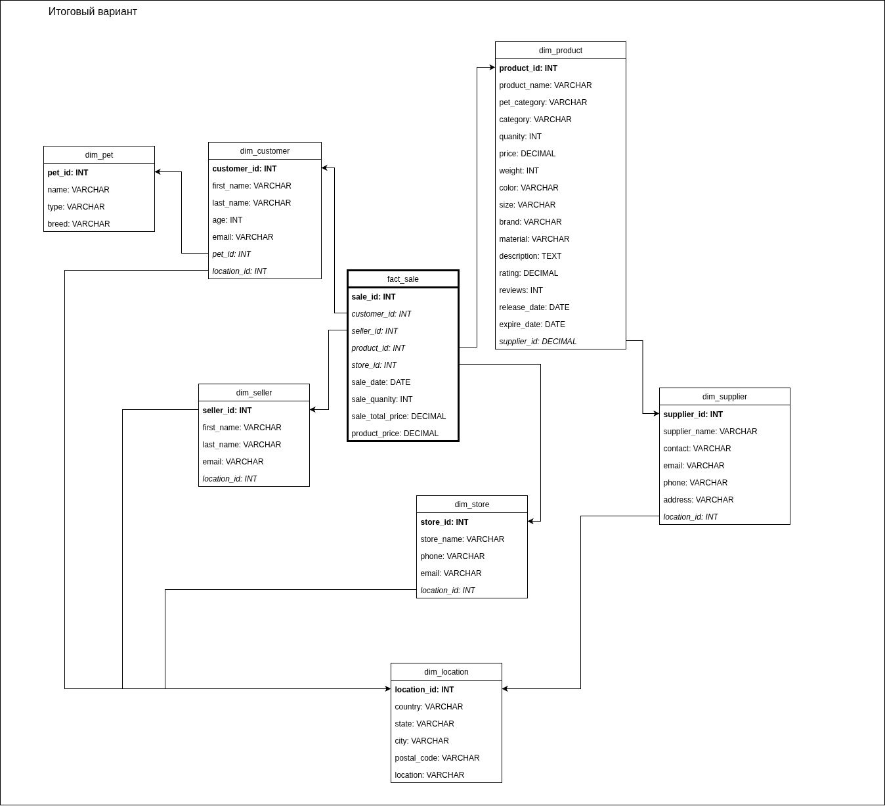

# BigDataSnowflake
Анализ больших данных - лабораторная работа №1 - нормализация данных в снежинку

## Содержание
1. Термины
2. Описание решения
3. Запуск
4. Результаты 

## Термины
**Снежинка (Snowflake schema)** - способ организации данных в реляционной БД, при котором таблица фактов находится в центре и окружена таблицами измерений, которые в свою очередь могут быть нормализованы в дополнительные таблицы. Напоминает по форме снежинку.

**SQL** - язык структурированных запросов для работы с реляционными базами данных. Позволяет создавать таблицы, вставлять, изменять, удалять и выбирать данные.

**DDL** - подмножество SQL для определения структуры базы данных. Включает команды `CREATE`, `ALTER`, `DROP` - то есть всё что касается создания и изменения таблиц, индексов, схем.

**DML** - подмножество SQL для работы с данными внутри таблиц. Включает команды `INSERT`, `UPDATE`, `DELETE`, `SELECT` - то есть всё что касается чтения и изменения самих данных.

**Docker** - платформа для запуска приложений в изолированных контейнерах. Контейнер содержит всё необходимое для работы приложения: код, зависимости, конфигурацию. Позволяет запускать одинаковое окружение на любой машине без ручной установки сервисов.

## Описание решения
Перед началом работы над лабораторной проанализируем исходные данные. Единая таблица CSV файла выглядит следущим образом:


Исходя из названий колонок, можно сразу заметить 6 выделяющихся таблиц измерений - `customer` `store` `seller` `product` `supplier` и таблицу фактов `sales`. Разделим данные по таблицам исходя из этой информации:


Далее можно представить несколько вариантов того как расположить таблицы в снежинку. Можно связать продавца с магазином и продукты с поставщиком, а в таблице покупателя отдельно выделить сущность питомца для нормализации данных.


Если отталкиваться от колонок с припиской `_id` в таблице фактов, то можно посчитать такую реализацию вполне допустимой. Одако также можно предположить, что на фактические продажи могут влиять все доступные в наших данных таблицы. Если это так, то добавим в таблицу продажи ключи по поставщикам и магазинам. Также нормализуем локации во всех таблицах, выделив их в отдельную сущность.


Смотря на оба полученных решения, я прихожу к следующим выводам:
1. В таблице фактов мы оставляем внешний ключ по id магазина, так как "условное" местоположение, акции, реклама конкретного магазина могут напрямую влиять на продажи;
2. Про поставщика я не могу также отзываться, поэтому убираем его, оставив внешний ключ по его id в таблице продукта;
3. Оставляем отдельные сущности "Локация" и "Питомец" для нормализации данных.

Итого получаем следующую схему:



После аналитической работы реализовываем функционал:
1. Инициализация сырых данных релизована в файле [init_mock_data.sql](/init/init_mock_data.sql);
2. Создание таблиц для снежинки - [DDL](/init/init_snowflake_tables.sql);
3. Вставка сырых данных в таблицы снежинки - [DML](/init/insert_snowflake_tables.sql).


## Запуск
Как и сказано в задании все реализовано и запускается в [docker-compose.yml](/docker-compose.yml). Для проверки необходимо только иметь установленный Docker.

### Ручной запуск
Для ручного запуска пропишите команды:
```bash
docker compose build -t

docker compose up -d
```

Для проверки результатов:
```bash
# Наличие таблиц в БД petshop_db
docker exec -it petshop_snowflake psql -U postgres -d petshop_db -c "\dt"

# Количество строк строк данных в каждой таблицы
docker exec petshop_snowflake psql -U postgres -d petshop_db -c "
SELECT 'mock_data' AS tbl, COUNT(*) FROM mock_data
UNION ALL SELECT 'dim_location', COUNT(*) FROM dim_location
UNION ALL SELECT 'dim_pet', COUNT(*) FROM dim_pet
UNION ALL SELECT 'dim_customer', COUNT(*) FROM dim_customer
UNION ALL SELECT 'dim_seller', COUNT(*) FROM dim_seller
UNION ALL SELECT 'dim_supplier', COUNT(*) FROM dim_supplier
UNION ALL SELECT 'dim_store', COUNT(*) FROM dim_store
UNION ALL SELECT 'dim_product', COUNT(*) FROM dim_product
UNION ALL SELECT 'fact_sales', COUNT(*) FROM fact_sales;
"

# Вывод первых 10 строк из таблицы фактов
docker exec -it petshop_snowflake psql -U postgres -d petshop_db -c "SELECT * FROM fact_sales LIMIT 10;"
```

### Автоматическйи запуск и проверка
В решении также предусмотрен [скрипт автоматизации](/run_solution.sh).

Скрипт автоматически:
- поднимает PostgreSQL;
- ждёт готовности сервиса;
- ждёт готовности скриптов инициализации бд и данных;
- выводит количество строк во всех таблицах и примеры данных.


## Результаты
> Таблицы в сформированной бд:

Schema |     Name     | Type  |  Owner   
-------|--------------|-------|----------
public | dim_customer | table | postgres
public | dim_location | table | postgres
public | dim_pet      | table | postgres
public | dim_product  | table | postgres
public | dim_seller   | table | postgres
public | dim_store    | table | postgres
public | dim_supplier | table | postgres
public | fact_sales   | table | postgres
public | mock_data    | table | postgres

> Количество строк в каждой таблице:

tbl          | count 
-------------|-------
mock_data    | 10000
dim_location | 27050
dim_pet      |  9321
dim_customer |  1000
dim_seller   |  1000
dim_supplier |   383
dim_store    |   383
dim_product  |  1000
fact_sales   | 10000


> Первые 10 строк таблицы фактов

sale_id | customer_id | seller_id | product_id | store_id | sale_date  | sale_quantity | sale_total_price | product_price 
--------|-------------|-----------|------------|----------|------------|---------------|------------------|---------------
1 |         372 |       372 |        372 |      148 | 2021-09-24 |             1 |           352.23 |         93.52
2 |         536 |       536 |        536 |      148 | 2021-08-31 |             6 |           355.44 |         55.77
3 |         651 |       651 |        651 |      148 | 2021-04-28 |             8 |            25.86 |         62.49
4 |          26 |        26 |         26 |      148 | 2021-01-23 |            10 |           134.77 |          5.96
5 |         532 |       532 |        532 |      148 | 2021-01-26 |             5 |           411.30 |         34.74
6 |         583 |       583 |        583 |      148 | 2021-12-08 |             4 |           133.12 |          8.70
7 |         687 |       687 |        687 |      148 | 2021-05-10 |             5 |           310.94 |          2.96
8 |           7 |         7 |          7 |      148 | 2021-07-27 |            10 |           196.49 |         64.66
9 |         697 |       697 |        697 |      148 | 2021-09-01 |             6 |           440.99 |         13.31
10 |         715 |       715 |        715 |      148 | 2021-06-03 |             6 |           174.65 |         55.89
